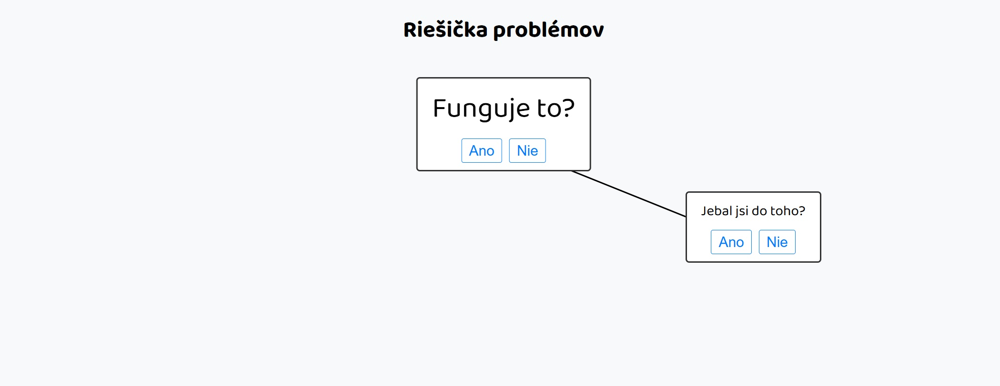

# Riešička problémov

Tento projekt je jednoduchý interaktivní diagram **Riešička problémov**, který nabízí humorný pohled na řešení problémů. Uživatelé mohou procházet jednotlivými rozhodovacími kroky a objevovat, kam je jejich volby zavedou.



## Funkce

- **Interaktivní uzly**: Každý uzel obsahuje otázky nebo odpovědi, které vedou na další krok.
- **Dynamické šipky**: Šipky propojují jednotlivé uzly podle logiky diagramu.
- **Humorný obsah**: Založeno na známém schématu "Riešička problémov".

## Omezení
- **Není responzivní**: Diagram momentálně nepodporuje změnu velikosti okna. Po změně velikosti je nutné stránku obnovit (F5).
- **Základní stylování**: Projekt je jednoduchý a snadno rozšířitelný.

## Jak používat
1. Klonuj tento projekt:
   ```bash
   git clone https://github.com/jan-zak/riesicka-problemov.git
2. Otevři soubor `index.html` v libovolném prohlížeči.
3. Procházej jednotlivými uzly klikáním na tlačítka a sleduj výsledek.

## Chci přispět!
Tento projekt je open-source a vítá jakékoliv úpravy, vylepšení nebo vlastní interpretace! Pokud máš návrh na zlepšení, neváhej otevřít **issue** nebo vytvořit **pull request**. Možnosti rozšíření:

-   Zlepšení responsivity (automatické překreslení šipek).
-   Přidání dalších vizuálních nebo interaktivních prvků.
-   Jakýkoliv jiný upgrade dle tvé fantazie!

## Licence
Tento projekt je licencován pod licencí MIT, což znamená, že si s ním můžeš dělat, co chceš – vylepšovat, používat, upravovat nebo integrovat do jiných projektů.

## Kontakt
Pokud máš otázky nebo zpětnou vazbu, klidně mě kontaktuj přes GitHub.